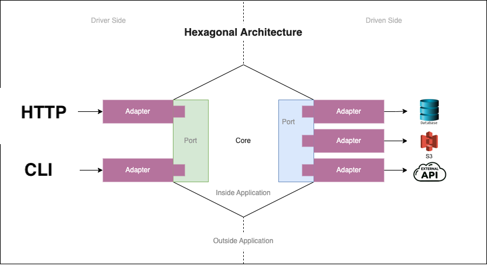

# [1337](https://en.wikipedia.org/wiki/Leet)[b04rd](https://en.wikipedia.org/wiki/Textboard)

## Learning Objectives

- REST API
- Authentication and Cookies
- S3 integration
- SQL with PostgreSQL
- Hexagonal Architecture
- Logging
- Testing
- Frontend basic
- Concurrency elementary

## Abstract

In this project, you will build a simple means of communication.

Similar projects have already helped millions of people around the world find friends and share their knowledge.

This assignment will teach you how to quickly create a simple means of communication, as well as how to combine your completely different projects into one fully functioning product.

## Context

Do you remember the days before Instagram and other social networks? Were you even born? In this project, we will immerse ourselves in the atmosphere when people just had to create their own means of communicating on the Internet.

Projects of this kind began to emerge at the end of the last millennium, during the early days of the internet, in the form of bulletin and boards forums. Although the ideas behind these projects were conceived long ago, over time they have only grown more refined.
The first versions of the forums or textboards did not have the ability to upload images, users had to use [ASCII art](https://en.wikipedia.org/wiki/ASCII_art) like this:

```
  ╱|、
(˚ˎ 。7  
 |、˜〵          
じしˍ,)ノ
```

Your version will be more advanced, the ability to add pictures to posts will be 😉.

You will create a simplified v3rsion of imageb0ard (@ kind 0f simpl3 f0ru|\/|) f0r [hackers](https://stallman.org/articles/on-hacking.html) (4r3 y0u 4 h@ck3r, righ7?). №0 u$3r r3gitr@ti0n is n33Ð3Ð, it'$ m0r3 fun 7h47 w@y.

## Resources

- Previous Project: [triple-s](https://github.com/alem-platform/foundation/blob/main/triple-s/README.md)
- Read about Hexagonal architecture [here](https://alistair.cockburn.us/hexagonal-architecture/)
- Read about [PostgreSQL](https://www.postgresql.org/docs/)
- Read about [🍪](https://datatracker.ietf.org/doc/html/rfc6265)

## General Criteria

- Your code MUST be written in accordance with [gofumpt](https://github.com/mvdan/gofumpt). If not, you will be graded `0` automatically.
- Your program MUST be able to compile successfully.
- Your program MUST not exit unexpectedly (any panics: `nil-pointer dereference`, `index out of range` etc.). If so, you will get `0` during the defence.
- External packages are allowed only for working with the database. If you use any other external packages, you will receive a grade of `0`.
- The test coverage of your project's code must be at least 20%. A lower percentage means `0` points for your project.
- The project MUST be compiled by the following command in the project's root directory:

```sh
$ go build -o 1337b04rd ./cmd/1337b04rd
```
- If an error occurs during startup (e.g., invalid command-line arguments, failure to bind to a port), the program must exit with a non-zero status code and display a clear, understandable error message.
  During normal operation, the server must handle errors gracefully, returning appropriate HTTP status codes to the client without crashing.

---

## Mandatory Part

### Baseline

Your task is to create a web application called `1337b04rd`, an anonymous imageboard. The frontend will be provided to you and your job is to implement the backend in Go.

You are expected to apply the best practices learned from previous projects.

### Functional Requirements

#### Hexagonal Architecture

The Hexagonal Architecture, also known as the Ports and Adapters pattern, is a design approach that promotes separation of concerns within an application. It achieves this by decoupling the core business logic from external systems like databases, web frameworks, and external APIs. In your application, implementing Hexagonal Architecture means structuring your code so that the domain logic remains independent of infrastructure and user interface concerns.



Note: CLI is optional in this project.

Examples:

- **Domain Layer (Core Business Logic):**
  - This layer contains the fundamental operations and rules of your application, such as creating posts, adding comments, and managing user sessions.
  - It defines interfaces (ports) for actions like storing data or fetching avatars but doesn't specify how these actions are implemented.
- **Infrastructure Layer (Adapters):**
  - This layer provides concrete implementations of the interfaces defined in the domain layer.
  - **Database Adapter**: Implements data persistence using PostgreSQL. If you decide to switch databases in the future, you only need to change this adapter without affecting the core logic.
  - **S3 Adapter**: Handles image storage in an S3-compatible service. The domain layer simply calls a method to store or retrieve images without knowing the underlying storage mechanism.
  - **External API Adapter**: Manages communication with the Rick and Morty API to fetch user avatars. If the avatar source changes, you can update or replace this adapter accordingly.
- **User Interface Layer**:
  - Interacts with the domain layer through defined interfaces.
  - **HTTP Handlers**: Process incoming HTTP requests, extract necessary data, and invoke the appropriate domain services.
  - **[Middleware](https://www.alexedwards.net/blog/making-and-using-middleware)**: Manages [authentication](https://auth0.com/docs/get-started/identity-fundamentals/authentication-and-authorization) and [session cookies](https://stackoverflow.com/questions/3804209/what-are-sessions-how-do-they-work) without embedding these concerns into the business logic.

By adhering to Hexagonal Architecture, your application gains several benefits:

- **Maintainability:** Changes in one part of the system (e.g., switching databases) require minimal adjustments elsewhere.
- **Testability:** You can unit test the core business logic without dependencies on external systems by [moc](https://stackoverflow.com/questions/2665812/what-is-mocking)[king](https://www.geeksforgeeks.org/software-testing-mock-testing/) the adapters.
- **Flexibility:** Adding new features or integrating with new services becomes more straightforward, as you can plug in new adapters without altering the core logic.

Implementing this architecture ensures that your application is robust, scalable, and adaptable to future requirements.

### Description of how your application should look like

You will be provided with 6 templates (read [here](https://pkg.go.dev/text/template)). You can change templates.

- `catalog.html`: Displays created threads with images in a tiled format.
  - Posts without comments are deleted after 10 minutes.
  - Posts with comments are deleted 15 minutes after the last comment.
  - User avatars are not displayed on this page.
  - There are buttons to go to the archive page and create a new thread.
- `archive.html`: Similar to the main page but displays all threads, including those deleted from the main page (`catalog.html`).
  - When accessing a deleted thread from this page, users can view the post and its comments but cannot add new comments.
  - There are buttons to go to the archive page and create a new thread.
- `post.html`: When a user clicks on a thread from the main page (`catalog.html`) or archive page (`archive.html`), they are taken to this page.
  - Displays the post (title, text, post ID, image if available) and its comments.
  - Users can add comments to the post.
  - Each user is assigned a unique avatar and name (name can be changed) from The Rick and Morty API, identified via cookies.
  - Avatars are unique per user; if all avatars are used, they can be reused (you need to find out how many avatars are provided by the API in total).
  - Users can reply to specific posts or comments by clicking on their IDs.
  - Comments indicate which post or comment they are responding to (use IDs).
  - Includes a button to return to the main page (`catalog.html`).
- `archive-post.html`: Similar to the `post.html` but for posts that have been deleted from the main page.
  - Users can view the post and its comments but cannot add new comments.
  - Avatars are preserved as they were when the post was active.
- `error.html`: Displays an error code and includes a "Back" button and a link to return to the `catalog.html`.
- `create-post.html`: page for creation new post
  - Includes a button to return to the `catalog.html`.

#### Session Management
- Implement session management using HTTP cookies.
- Sessions should have an appropriate expiration time (1 week).
- Associate user data (e.g., avatar assignment) with their session.

For more details, refer to [secure cookie configuration](https://developer.mozilla.org/en-US/docs/Web/Security/Practical_implementation_guides/Cookies) .

#### User Identification, Avatars and Names

  - Users are tracked via browser sessions using cookies.
  - Upon first visit, assign the user a unique avatar and name from [The Rick and Morty API](https://rickandmortyapi.com/). You will need to figure out how to get avatars and names on your own.
  - Store the avatar assignment in the user's session and posts.
  - Ensure that avatars are unique among users on a post page.
  - If the number of users exceeds the number of available avatars, avatars may be reused.

#### Posts and Comments

**Posts:**
- Consist of a title, text content, post ID (must be unique), user avatar, name and an optional image.
- If the user has specified a name, then in all messages and comments of the user the name obtained through the API should be replaced with a new one.
- Deletion rules:
  - If a post has no new comments for 15 minutes, it should be deleted from the Main Page (Catalog Page).
  - A new post without comments should be deleted from the Main Page (Catalog Page) after 10 minutes.

**Comments:**
- Users can add comments to posts.
- Comments can reply to the original post or other comments.
- Each comment should indicate whether it is a reply to the post or another comment.
- Users can click on the ID of a post or comment to reply to it.
- Сomments should display your comment ID and user avatar.

#### Data Storage 
- Use PostgreSQL to store posts, comments, user sessions, and any necessary metadata.
- Use S3-compatible storage for images attached to posts and comments (use at least 2 buckets). You have to use your code from the previous `triple-s` project (alternatively, you can use [MinIO](https://github.com/minio/minio)). You can improve on your previous project.
- Ensure that image uploads are validated and securely handled.

***Note:** you should not save the user's avatar images locally.

#### General Functionality
- Implement a RESTful API server in Go that serves the provided frontend.
- Use only the standard Go library and library(s) for PostgreSQL database interactions.
- Utilize the `log/slog` package from the standard library for logging.
- Store posts and comments in an PostgreSQL database.
- Store images attached to posts and comments in S3-compatible storage (use you previous [project](https://github.com/alem-platform/foundation/blob/main/triple-s/README.md)).
- No user registration; users are identified via browser [sessions](https://en.wikipedia.org/wiki/Session_(computer_science)) ([cookies](https://developer.mozilla.org/en-US/docs/Web/HTTP/Cookies)).
- Assign each user a unique avatar from the Rick and Morty universe, retrieved via [The Rick and Morty API](https://rickandmortyapi.com/).


### Logging
- Use Go's `log/slog` package for logging throughout the application.
- Log significant events, errors information with appropriate levels (`Info`, `Warning`, `Error` and [others](https://signoz.io/guides/golang-slog/)).
- Include contextual information in logs (e.g., timestamps, IDs).

### Testing 

Testing is an essential aspect of software development that ensures your application functions as intended and is free from critical bugs. In this project, you are required to write tests covering **at least 20% of your codebase**. While this percentage is modest, it encourages you to begin incorporating testing into your development workflow.

Focus on writing unit tests for core functionalities such as:

- Creating posts and comments
- Managing user sessions, avatars and names
- Interacting with the PostgreSQL database
- Integrating with external services like S3 storage and The Rick and Morty API

By implementing these tests, you will:
- Validate Business Logic: Ensure that your core features work correctly under various conditions.
- Improve Code Quality: Identify and fix bugs early in the development process.
- Facilitate Refactoring: Make future code changes with confidence, knowing that tests will catch regressions.
- Enhance Maintainability: Well-tested code is easier to understand and maintain over time.

Remember to use Go's built-in `testing` package testing to write your tests. Aim for clarity and simplicity in your test cases, and consider edge cases that might cause unexpected behavior. Incorporating testing into your development process not only fulfills the project requirement but also cultivates good coding practices that are valuable in real-world applications.

This command will recursively run all tests in all packages of your project. If you want to get detailed output for each test, add the `-v` (verbose) flag:

```bash
go test -v ./...
```

**Notes:**

- Make sure that all your test files follow the naming convention `*_test.go`.
- The `./...` command tells Go to check the current directory and all subdirectories for tests.
- Сheck out [this](https://go.dev/doc/tutorial/add-a-test) article.

### Usage

Your program must be able to print usage information.

Outcomes:
- Program prints usage text.

```sh
$ ./1337b04rd --help
hacker board

Usage:
  1337b04rd [--port <N>]  
  1337b04rd --help

Options:
  --help       Show this screen.
  --port N     Port number.
```

Don't forget to start your S3 storage.

---

## Optional task

[Open source](https://en.wikipedia.org/wiki/Open-source_software) is immensely popular in the software development world. Many developers share their programs globally, enabling others to use, improve, share, and reuse their code. Choose the most suitable license for your project with care and thorough consideration. Be careful.

**Notes:** 
- Open source software and free software are different concepts.
- This is truly an optional task.

Funny links: [link0](https://docs.github.com/en/repositories/managing-your-repositorys-settings-and-features/customizing-your-repository/licensing-a-repository), [link1](https://opensource.org/license), [link2](https://www.fsf.org/resources/), [link3](https://www.gnu.org/philosophy/free-sw.en.html), [link4](https://archive.org/details/the_free_software_song-cover-by-daniel_kelly)

---

## Support

Pay special attention to how you manage user sessions, cookies, and the architecture of the application.

All you need is perseverance, people around you, and the internet.

[Timers](https://gobyexample.com/timers) and [tickers](https://gobyexample.com/tickers) can help you implement some functionality such as moving posts to the archive.

Good luck.

## Guidelines from Author

Before you start writing code, think carefully about the structure of your future application. 

You might like to use [TDD](https://en.wikipedia.org/wiki/Test-driven_development)

If you are not working alone, divide the study of the material and discuss more.

---

## Author

This project has been created by:

Savva Savostyanov

Contacts:

- Email: [savvax@savvax.com](mailto:savvax@savvax.com)
- [GitHub](https://github.com/savvax/)
- [LinkedIn](https://www.linkedin.com/in/savvax/)
