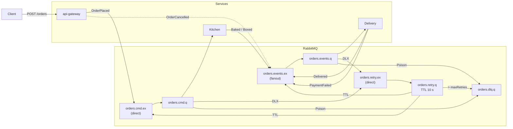

# wheres-my-pizza

## Learning Objectives

- Event-driven architecture
- RabbitMQ: work-queue, fan-out, dead-letter / retry queues, manual **ACK/NACK + QoS**
- Exchange types & routing keys
- Transactional Outbox pattern (**events** table) + PostgreSQL
- Idempotent message processing (Inbox tables)
- Docker-Compose orchestration
- Unit, contract & end-to-end testing

---

## Abstract

Build **wheres-my-pizza**, a three-service Go application that tracks a pizza order from placement to delivery.
All inter-service communication happens through RabbitMQ events—**no synchronous HTTP**.
A single transactional outbox keeps the DB and broker consistent; consumers stay idempotent via inbox tables.
The public REST API is **read-only** and lets clients query order status and full event history.

---

## Context

HTTP chains between micro-services quickly create tight coupling, cascading time-outs and clumsy retries.
Message brokers decouple services, buffer spikes, and let each bounded context fail or scale in isolation.
Pizza’s natural flow—**Order Placed -> Kitchen -> Delivery**—is perfect for visualising event-driven patterns.

---

## Resources

- RabbitMQ tutorials – [https://www.rabbitmq.com/getstarted.html](https://www.rabbitmq.com/getstarted.html)
- Transactional Outbox pattern – [https://microservices.io/patterns/data/transactional-outbox.html](https://microservices.io/patterns/data/transactional-outbox.html)
- RabbitMQ reliability & DLX – [https://www.rabbitmq.com/reliability.html](https://www.rabbitmq.com/reliability.html)
- Idempotent consumer pattern – [https://microservices.io/patterns/communication-style/idempotent-consumer.html](https://microservices.io/patterns/communication-style/idempotent-consumer.html)
- AMQP 0-9-1 Go client – [https://github.com/rabbitmq/amqp091-go](https://github.com/rabbitmq/amqp091-go)
- pgx PostgreSQL driver – [https://github.com/jackc/pgx](https://github.com/jackc/pgx)

---

## General Criteria

| Rule               | Requirement                                                                                                    |
| ------------------ | -------------------------------------------------------------------------------------------------------------- |
| **Code style**     | Must pass `gofumpt`.                                                                                           |
| **Dependencies**   | **Only** stdlib + `amqp091-go` + `pgx/v5`.                                                                     |
| **Configuration**  | All settings come from **environment variables** (ports, DSN, prefetch, exchange / queue names). **No flags**. |
| **Docker-Compose** | `docker compose up` spins RabbitMQ, PostgreSQL and three services; `docker compose down -v` cleans everything. |
| **Testing**        | Unit, contract **and** e2e tests cover outbox publish, retry/DLQ flow and idempotency.                         |

---

## Mandatory Part

### 1. Baseline

You will create a hexagon-inspired solution consisting of three Go services and one PostgreSQL schema.

#### Outcomes

- **init.sql** defining:

  | Table / Enum        | Fields & Purpose                                                                                |
  | ------------------- | ----------------------------------------------------------------------------------------------- |
  | `order_status` enum | `placed`, `baked`, `boxed`, `payment_failed`, `delivered`, `cancelled`                          |
  | `orders`            | `id` (UUID PK), `status`, `pizza`, timestamptz                                                  |
  | `events` (outbox)   | `id` (UUID PK), `order_id` FK, `type`, `payload` (JSONB), `created_at`, `published_at` nullable |
  | `kitchen_inbox`     | processed `events.id` for **kitchen** deduplication                                             |
  | `delivery_inbox`    | processed `events.id` for **delivery** deduplication                                            |

  Add sensible indexes (`orders(status)`, `events(order_id)`, GIN on `events.payload`).

- **Service boundaries**

  | Service       | Port | Responsibilities                                                                                                                                                                                                |
  | ------------- | ---- | --------------------------------------------------------------------------------------------------------------------------------------------------------------------------------------------------------------- |
  | `api-gateway` | 8080 | `POST /orders` (insert order **+** outbox event atomically). `GET /orders/{id}` (order row + history). Background poller selects unpublished events, publishes, then sets `published_at` _after_ broker **ACK** |
  | `kitchen`     | —    | Consumes `order.placed` -> emits `Baked` and `Boxed`. Uses `kitchen_inbox`. Manual ACK/NACK, prefetch read from env (default 20).                                                                               |
  | `delivery`    | —    | Consumes `order.boxed` -> attempts payment -> emits `Delivered` **or** `PaymentFailed`. Uses `delivery_inbox`. On `PaymentFailed` the api-gateway issues `OrderCancelled`.                                      |

- **RabbitMQ topology**

  | Name               | Kind / Args                | Notes                       |
  | ------------------ | -------------------------- | --------------------------- |
  | `orders.cmd.ex`    | `direct`                   | Kitchen work-queue exchange |
  | `orders.events.ex` | `fanout`                   | Broadcast domain events     |
  | `orders.retry.ex`  | `direct`                   | Shared retry exchange       |
  | `orders.cmd.q`     | DLX -> `orders.retry.ex`   | Commands to kitchen         |
  | `orders.events.q`  | DLX -> `orders.retry.ex`   | Events to delivery          |
  | `orders.retry.q`   | TTL 10 s, DLX -> source ex | Automatic delayed retry     |
  | `orders.dlq.q`     | Dead-letter sink           | Poison messages             |



Routing keys follow `order.<stage>` (e.g. `order.placed`, `order.boxed`, `order.delivered`).
**ACK/NACK policy**:

1. Success -> ACK
2. Retryable error -> NACK `requeue=false` (first passes through `orders.retry.q`)
3. Poison message -> NACK `requeue=false` -> DLQ

- **API endpoints**

  | Method & Path       | Description                                                  |
  | ------------------- | ------------------------------------------------------------ |
  | `POST /orders`      | Body `{ "pizza": "Margherita", "force_payment_fail": true }` |
  | `GET  /orders/{id}` | Returns order row plus ordered event history                 |

### 2. Validation Scenarios (must be covered by e2e tests)

1. Happy path — Order goes **Placed -> Boxed -> Delivered**
2. Kitchen outage — stop `kitchen`, post order, start again; retry flow delivers event
3. Forced payment failure — `force_payment_fail=true` ends in `OrderCancelled`
4. Poison message lands in `orders.dlq.q`; consumers keep working
5. History check — `GET /orders/{id}` always returns complete timeline

### 3. Configuration & Logging

- Read env-vars:

  ```env
  DB_HOST, DB_PORT, DB_USER, DB_PASSWORD, DB_NAME
  RMQ_URL, RMQ_PREFETCH
  HTTP_PORT (api-gateway only)
  ```

- Use `log/slog`. Log **Info** when publishing events, **Warning** on retries, **Error** on DLQ sends.

- Exit non-zero if startup fails; otherwise handle errors gracefully.

### 4. Shutdown

Trap `SIGINT`/`SIGTERM`, drain consumers, wait for in-flight DB or broker operations, then exit.

### 5. Usage

Example for gateway:

```sh
$ ./api-gateway

Environment:
  DB_*         PostgreSQL connection
  RMQ_URL      AMQP connection URI
  ...
```

---

## Support

Focus first on **outbox -> RabbitMQ -> inbox** happy path.
Once solid, add retry/DLQ, then history API, then tests.

Good luck.

---

## Guidelines from Author

1. Implement database schema and outbox publisher.
2. Wire minimal consumer in `kitchen`; emit `Boxed`.
3. Add `delivery` with payment simulation.
4. Introduce retry exchange & DLQ.
5. Write e2e tests with **Testcontainers-go**.

---

## Author

This project has been created by:

Yelnar Moldabekov

Contacts:

- Email: [mranle91@gmail.com](mailto:mranle91@gmail.com/)
- [GitHub](https://github.com/ymoldabe/)
- [LinkedIn](https://www.linkedin.com/in/yelnar-m/)
